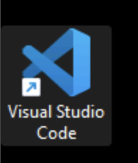
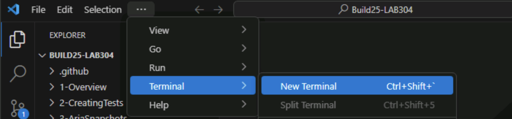
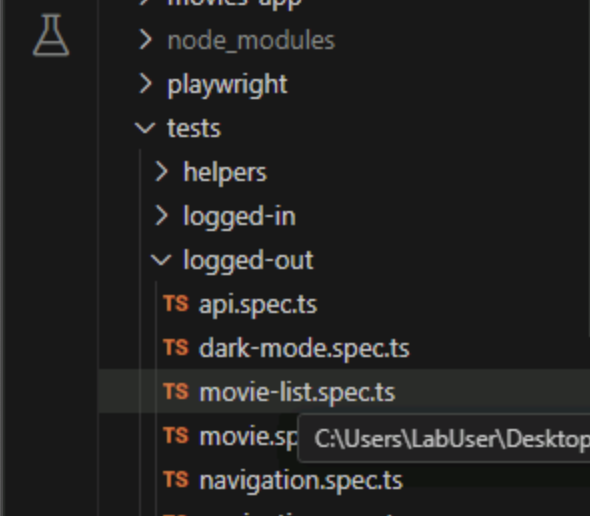
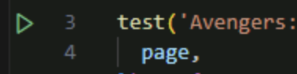

# 1 Overview of Playwright, Project Structure, and Config

## Goal

This section introduces the Playwright framework, explains the project’s folder structure and configuration, and demonstrates how to start the sample application and run an initial Playwright test. The aim is to build familiarity with the tools and setup needed for effective end-to-end testing.

## What is Playwright?

Playwright is a powerful open-source framework developed by Microsoft for reliable end-to-end testing and automation of modern web applications. It allows you to write tests that run across all major browsers (Chromium, Firefox, WebKit) using a single API, simulating real user interactions like clicking, typing, and navigating.

This project serves as a hands-on guide for learning Playwright. It involves testing a sample Next.js application (movies-app) using Playwright's features for end-to-end testing. You'll explore the project structure, understand configuration, write and run tests, and learn how to run Playwright tests at scale.

In this section, you'll get familiar with the project setup and run your first Playwright test.

---

## 🗂 Project Structure Overview

1. [] Open up VS Code to explore the project structure.

Open the project folder in VS Code to get an overview of the files and directories. This will help you understand where the application code, tests, and configuration files are located.

Here's a quick look at the folder layout:

- **movies-app/**  
  The [Next.js](https://nextjs.org/) application you'll be testing.  
- **tests/**  
  Where the Playwright test files live. You'll see folders like:
  - logged-in/
  - logged-out/
  - helpers/ (utility functions)
  - mocks/ (API mocking utilities)
- **playwright.config.ts**  
  The main config file for Playwright tests.

---

## ▶️ Start the App

Run the application.

1. [] Open a new terminal in VS Code. You can do this by clicking on the **Terminal** menu and selecting **New Terminal** or using the shortcut (Ctrl + `).

2. [] **Start the app**: `npm run dev`
3. [] Open your browser and navigate to `http://localhost:3000` to see the app running. You can also command click on the URL in the terminal to open it in your default browser.

---

## ✅ Run Your First Test

1. [] **Open the movie-list test**: Navigate to the **tests/logged-out** folder in the Explorer panel and double-click on **movie-list.spec.ts**.

2. [] **Run the test**: Click on the play button next to the test name:

---

## 💬 What’s Happening?

When you run the test, Playwright automatically launches a browser window and executes the test steps as if a real user were interacting with the app. Take a moment to switch back to VS Code and review the test code—notice how it describes the actions being performed (like navigating to a page or checking for specific content). This helps you understand exactly what the test is verifying and how Playwright simulates user behavior.

- What is it trying to verify?
- Is it checking elements, navigation, or content?

We'll go deeper into test structure soon!

---

## Check-in

At the end of this section, you should be able to:
- Understand the project structure.
- Run the application locally.
- Run a Playwright test.
- Understand the Playwright config file.
- Know where to find test files.
