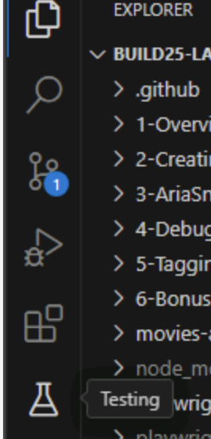
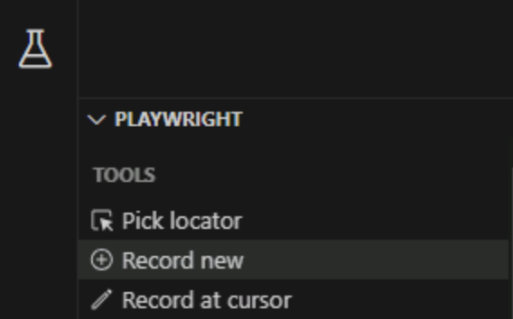
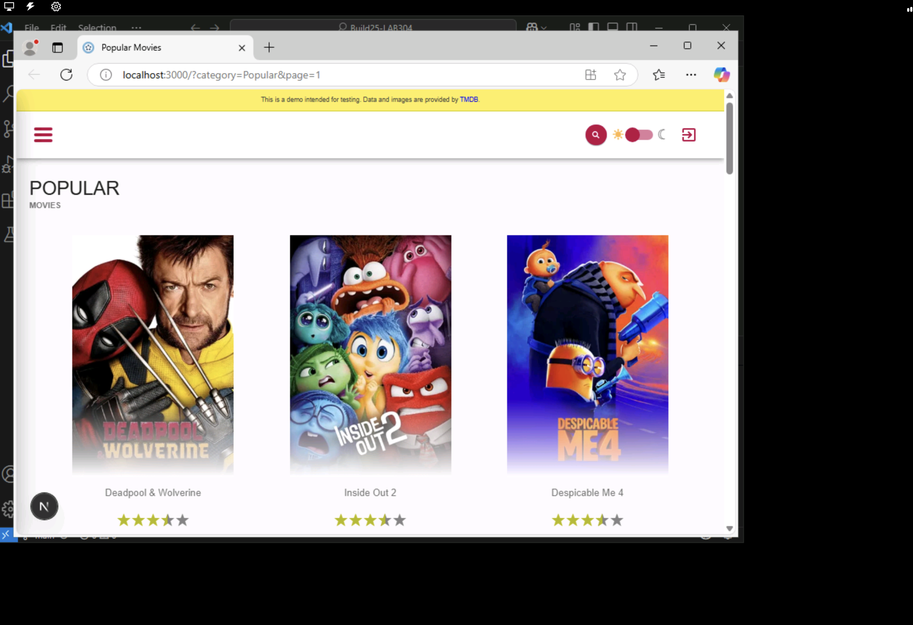
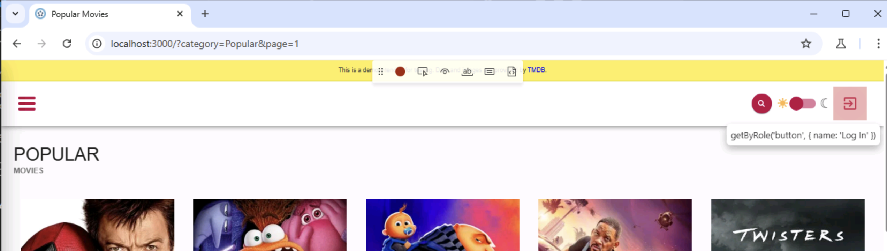
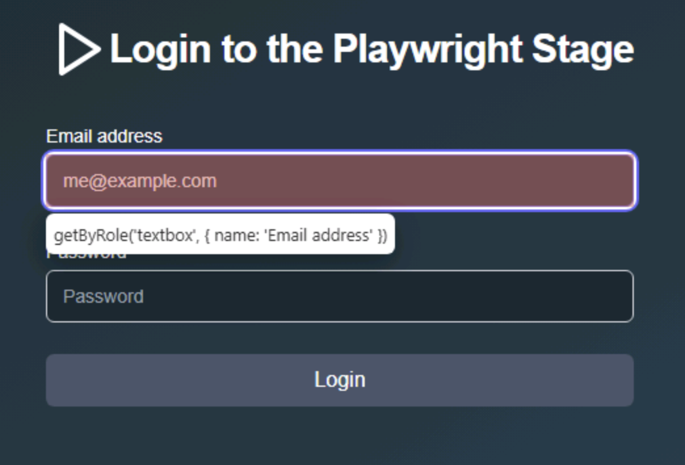
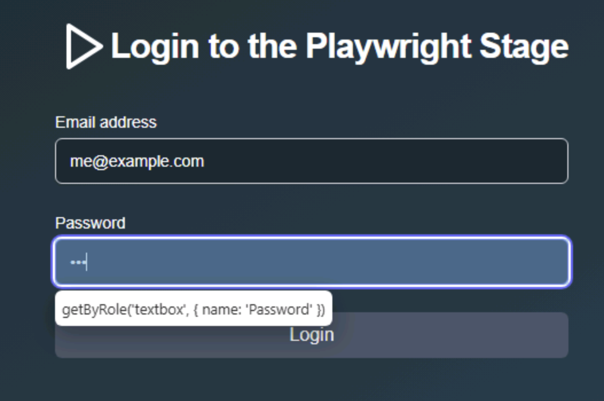
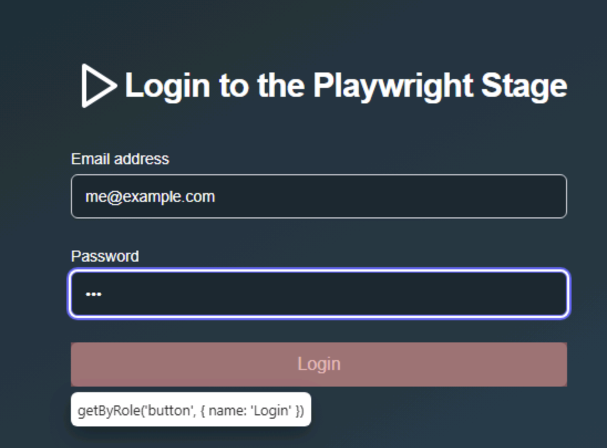
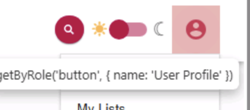
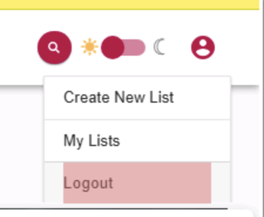
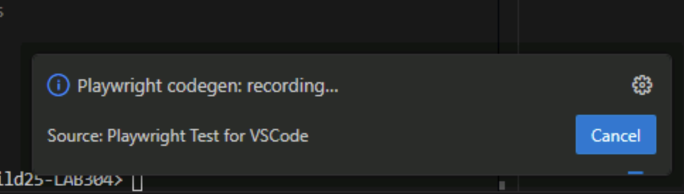

# 2. Generating Tests with Playwright's Codegen

In this section, you'll learn how to automatically generate Playwright test code by simply interacting with your web application. We'll explore two methods for using Playwright's Codegen feature: the integrated VS Code extension and the command-line tool. We will also cover the essential practice of securely managing credentials using environment variables instead of hardcoding them in your tests.

## Overview of Codegen

Playwright Codegen is a tool that helps you automatically generate test code. It works by recording your interactions (like clicks, typing, navigation) as you use your web application in a browser window controlled by Playwright.

As you interact, Codegen translates these actions into Playwright test script code. This generated code can then be saved into a test file, providing a quick starting point for writing your end-to-end tests. You can use Codegen either through the integrated Playwright VS Code extension or via a command-line interface (npx playwright's Codegen).

## Recording Tests using the VS Code Extension

The Playwright VS Code extension provides an integrated way to record tests directly within your editor.

1. [] **Open the Testing Sidebar:** Click on the Testing icon (looks like a beaker) in the VS Code Activity Bar on the left.



2. [] **Start Recording:** Find the "Record new" button (often near the top of the Testing sidebar) and click it.


This will open a new browser window controlled by Playwright.

1. [] Navigate to the application URL (e.g., `http://localhost:3000`).  az


2. [] Click the "Log In" button.


3. [] Fill in the email with `me@example.com`.


4. [] Fill in the password field `111`.


5. [] Click the login button.


6. [] Click the user profile button.


7. [] Click the logout button.


1.  [] **Stop Recording:** Once you've recorded the desired steps, click the "Cancel" button in VS Code.



5. [] **Review and Save the Code:** VS Code will automatically generate the test code in a new editor window.
  * Review the generated code.
  * Save the file in your **tests/logged-out** directory with a descriptive name (e.g., **auth.spec.ts**).
6. [] **Run your new test:** Press the **Play button** next to the test in VS Code to ensure it works correctly.

## Securely storing credentials in tests

It's important not to hardcode sensitive information like usernames and passwords directly into your tests. A common practice is to use environment variables stored in a **.env** file. See the **example.env** file. 

**We have safely stored the credentials for you in the System Environment Settings for demo purposes, so you just need to update the test to use them.**

1. [] **Update the test code to use environment variables** instead of hardcoded values. 
   * Open the **auth.spec.ts** file you just created.
   * Replace the hardcoded email and password with the following code:

```typescript
await page.getByRole('textbox', { name: 'Email address' }).fill(process.env.MOVIES_USERNAME!);

await page.getByRole('textbox', { name: 'Password' }).fill(process.env.MOVIES_PASSWORD!);
```

1. [] **Run your test:**
Save the file and run your test again to ensure the generated test works correctly with the environment variables.

## Check-in

Compare your generated **auth.spec.ts** file with the one provided in the **solution** folder for this section. Verify that your test correctly performs the login and logout steps and utilizes environment variables for the username and password, rather than hardcoding them.
