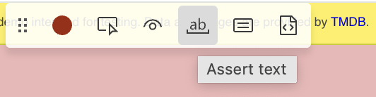
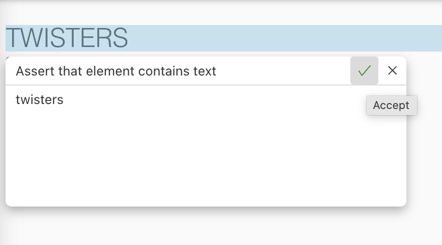
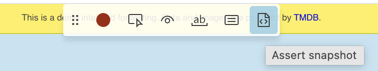
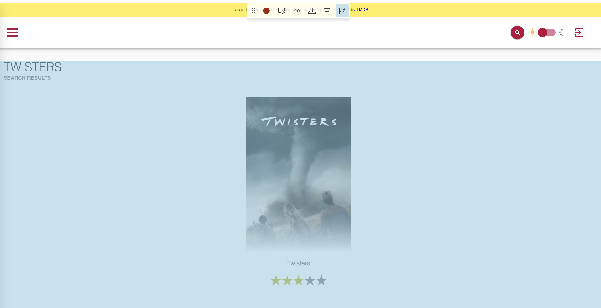
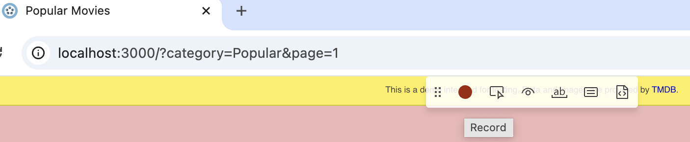

# 3. Aria Snapshots and Helper Functions

## Goal

This section focuses on using Playwright's Codegen to generate a search test, and add various assertions like **toMatchAriaSnapshot**, **toHaveURL**, and **toHaveAttribute** to verify application state, and refactoring the generated code into reusable helper functions for cleaner, more maintainable tests.

## Step 1: Record the Search Interaction

1. [] Start a new recording by pressing **Record new** in the testing sidebar. In the browser window opened by Codegen
2. [] Navigate to the home page (e.g., `http://localhost:3000`).
3. [] Click the search icon or field.
4. [] Type your search term (e.g., "twisters").
5. [] Click the search button.
6. [] click on the assert text icon

7. [] Click on the main page heading.

8. [] click on the assert snapshot

9. [] click next to the movie poster. 

10. [] Click the "red" button to stop the recording.
 

Your test code should look something like this:

```ts
import { test, expect } from '@playwright/test';

test('test', async ({ page }) => {
  await page.goto('http://localhost:3000/?category=Popular&page=1');
  await page.getByRole('search').click();
  await page.getByRole('textbox', { name: 'Search Input' }).fill('twisters');
  await page.getByRole('textbox', { name: 'Search Input' }).press('Enter');
  await page.getByRole('button', { name: 'Search for a movie' }).click();
  await expect(page.locator('h1')).toContainText('twisters');
  await expect(page.getByLabel('movies')).toMatchAriaSnapshot(`
    - list "movies":
      - listitem "movie":
        - link "poster of Twisters Twisters rating":
          - /url: /movie?id=tt12584954&page=1
          - img "poster of Twisters"
          - heading "Twisters" [level=2]
    `);
});
```

### Differences between **toHaveText** and **toMatchAriaSnapshot**

The **toHaveText** assertion targets a specific element, like the **"h1"** heading, and verifies that its exact visible text content matches the provided string ("Twisters").

In contrast, **toMatchAriaSnapshot** examines a larger region, such as the **"main"** content area, and checks its overall accessible structure—including element roles, names, and levels—against a stored snapshot. While **toHaveText** focuses on the precise visual text of one element, **toMatchAriaSnapshot** validates the semantic structure and accessibility of potentially multiple elements within a section.


### Step 4: Save and run the Test

1. [] Save your test as **search.spec.ts** file.
2. [] Run the test using the VS Code Test Explorer (click the play button next to the test)
   
### Modify the Test Name (Optional but Recommended)

It's good practice to give your tests descriptive names that clearly state what they are verifying.

To change the test name, simply edit the first argument (the string) passed to the **test** function.

**Example:**

Change this:
```ts
test('test', async ({ page }) => {
  // ... test code ...
});
```

To this:
```ts
test('search for "Twisters" movie and navigate to details page', async ({ page }) => {
  // ... test code ...
});
```

### Bonus Step: Create another test for a movie that does not exist
1. [] Use Codegen to record the search interaction for a movie that does not exist (e.g., "non-existent-movie").
2. [] Add assertions to check the state of the application when no results are found. For example:
  * Use **toMatchAriaSnapshot** to verify the message displayed when no results are found.
3. [] Check that you can navigate back to the home page.
4. [] Modify the test name
5. [] Runt the test to ensure it works correctly

Your test code should look something like this:

```ts
import { test, expect } from '@playwright/test';

test('search for non-existent-movie', async ({ page }) => {
  await page.goto('http://localhost:3000/?category=Popular&page=1');
  await page.getByRole('search').click();
  await page.getByRole('textbox', { name: 'Search Input' }).fill('non-existent-movie');
  await page.getByRole('search').click();
  await page.getByRole('button', { name: 'Search for a movie' }).click();
  await expect(page.getByRole('main')).toMatchAriaSnapshot(`
    - main:
      - heading "Sorry!" [level=3]
      - heading "There were no results for non-existent-movie..." [level=4]
      - img "Not found!"
      - link "Home":
        - /url: /?category=Popular&page=1
        - button "Home":
          - img
    `);
  await page.getByRole('button', { name: 'Home' }).click();
});
```

## Check-in

Ensure your **search.spec.ts** file contains a test that contains assertions including **toMatchAriaSnapshot**.
