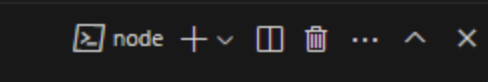

# 4. Debugging Tests with Playwright UI Mode and AI Assistance

## Goal

Learn how to use Playwright's UI Mode for interactive debugging and leverage AI assistance for faster troubleshooting. Understand how to configure and view test traces for post-mortem analysis, especially in CI environments.

## Overview

Playwright's UI Mode offers an intuitive visual interface for running and debugging tests interactively. When a test fails, UI Mode displays comprehensive details such as error messages, call logs, and page snapshots, making it easier to pinpoint issues. Additionally, you can streamline troubleshooting by using the **Copy Prompt** button in the Errors tab. Simply paste the copied prompt into GitHub Copilot Chat in VS Code to get AI-powered explanations and suggested fixes for your test failures.

## Running Tests in UI Mode

1. [] **Open a second terminal in VS Code** Click on the plus button in the terminal window or in the **Terminal** menu select **New Terminal**.

1. [] **Run the UI Mode command:** `npx playwright test --ui`
    This will open the Playwright UI Mode window, listing all your tests.
2. Press the play button to run all tests or select specific tests to run by clicking on them in the left-hand sidebar.

### Stepping Through Test Execution

1. [] **Select a Test:** In UI Mode, click on any test (passing or failing) in the left sidebar.
2. [] **Use the Timeline:** The central panel shows a timeline of actions performed during the test run.
3. [] **Inspect Actions:** Click on any action in the timeline (e.g., **page.click**, **page.fill**). UI Mode will highlight the corresponding element on the page snapshot (Before/After) and show details like execution time and parameters.
4.  **Time Travel:** Use the slider or click directly on actions to "time travel" through the test execution, observing the page state at each step.

## Debugging a Failing Test

1. [] **Identify the Failing Test:** In the UI Mode window, failing tests will be marked clearly (usually with a red 'x'). Click on the failed test in the left-hand sidebar to select it.
2. [] **Navigate to the Errors Tab:** In the central panel displaying the test details, locate and click on the **Errors** tab. This tab shows the specific error message, the call log leading up to the failure, and often a snapshot of the page state when the error occurred.
3. [] **Fix the test:** 
4. [] **Re-run the Test:** After making the suggested changes, return to the Playwright UI Mode and re-run the test if you haven't activated watch mode, to verify if the issue is resolved. 

## Viewing Traces

Playwright traces are invaluable for debugging failures that occur in automated CI environments where you can't use UI Mode directly. You can configure Playwright to automatically capture traces, especially for flaky or failing tests.

### Failing Test

First let's ensure we still have a failing test. Undo the fix from the last step so that the test fails again or feel free to open any test and add a failing assertion.

### Configuring Traces

A common strategy is to only record a trace when a test fails and is retried for the first time. This avoids generating large trace files for every successful run but captures the necessary details when a failure occurs.

- **Review the **playwright.config.ts**:** Open your Playwright configuration file.
- Ensure you have retries enabled in your CI environment configuration within the config file. **on-first-retry** only works if retries are greater than 0.
- In the **use** block of your configuration (potentially within a specific configuration for CI), ensure the **trace** option is set to **'on-first-retry'**.

### Accessing the Trace in the HTML Report

When tests run locally (e.g., using `npx playwright test`), Playwright generates an HTML report in the **playwright-report** folder. 

1. [] Run all your tests using the command: `npx playwright test`.
2. [] Open the report with `npx playwright show-report` and navigate to the test you want to inspect, and click the trace icon next to the test run. This opens the Trace Viewer directly in your browser, allowing you to step through the execution, view snapshots, and inspect network requests.

The same HTML report can be generated and accessed from CI runs; you'll typically download it as an artifact. For detailed guidance on configuring trace uploads and viewing reports in various CI environments, refer to the official [Playwright documentation on Trace Viewer](https://playwright.dev/docs/trace-viewer) and CI integrations.

## Check-in

You should now be comfortable using Playwright UI Mode to run, inspect, and debug tests interactively. You've also learned how to utilize AI assistance for diagnosing failures and how to configure and access Playwright traces for debugging tests run in CI or headless modes.

