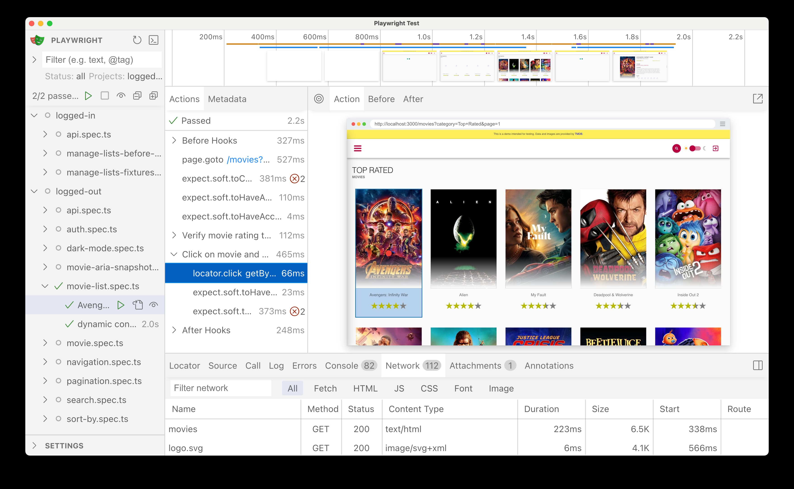

# Build 2025 Lab 304: Real-World, Enterprise-Scale End-to-End Testing with Playwright

In this lab, you will dive into end-to-end testing with Playwright using a sample movies app. You'll learn to generate tests with Codegen, write robust assertions including ARIA snapshots, manage credentials securely, debug effectively using UI Mode and traces, organize tests with tags and annotations, and optimize execution speed with sharding.

The source code includes a demo Movies App built with Next.js and React, utilizing the [The Movie Database (TMDB)](https://www.themoviedb.org/) API for testing purposes. This project is a fork of [next-movies](https://github.com/tastejs/next-movies) and has been customized for this lab.

## Agenda

Follow these sections in sequence to learn key Playwright concepts:

1.  [Overview of Playwright, Project Structure, and Config](./1-Overview/README.md)
2.  [Generating Tests with Codegen and Managing Credentials](./2-CreatingTests/README.md)
3.  [Using Aria Snapshots and Creating Helper Functions](./3-AriaSnapshots/README.md)
4.  [Debugging Tests with UI Mode, AI, and Traces](./4-Debugging/README.md)
5.  [Organizing Tests with Tags and Annotations](./5-TaggingAnnotations/README.md)
6.  [Bonus: Speeding Up Tests with Sharding](./Bonus-Sharding/README.md)

## Check-in

By completing all sections of this lab, you should have a solid understanding of how to:

*   Set up and configure a Playwright testing environment.
*   Generate initial test code using Playwright Codegen.
*   Write effective assertions, including accessibility checks with `toMatchAriaSnapshot`.
*   Securely manage sensitive data like credentials using environment variables.
*   Refactor tests using helper functions for better maintainability.
*   Debug test failures efficiently using Playwright UI Mode, AI assistance (like Copilot Chat), and trace files.
*   Organize your test suite using tags and annotations for selective runs and metadata.
*   (Bonus) Optimize test execution time in CI/CD pipelines using sharding.

You should now be equipped to apply these techniques to build robust and scalable end-to-end test suites for real-world applications using Playwright.

## Playwright Resources

-   [Playwright Documentation](https://playwright.dev/docs/intro)
-   [Playwright API Reference](https://playwright.dev/docs/api/class-playwright)
-   [Playwright VS Code Extension](https://marketplace.visualstudio.com/items?itemName=ms-playwright.playwright)
-   [Playwright on GitHub](https://github.com/microsoft/playwright)

